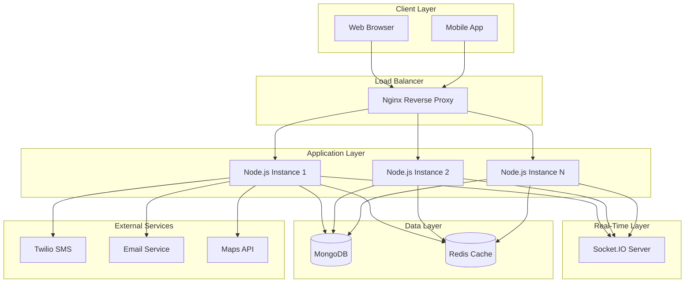
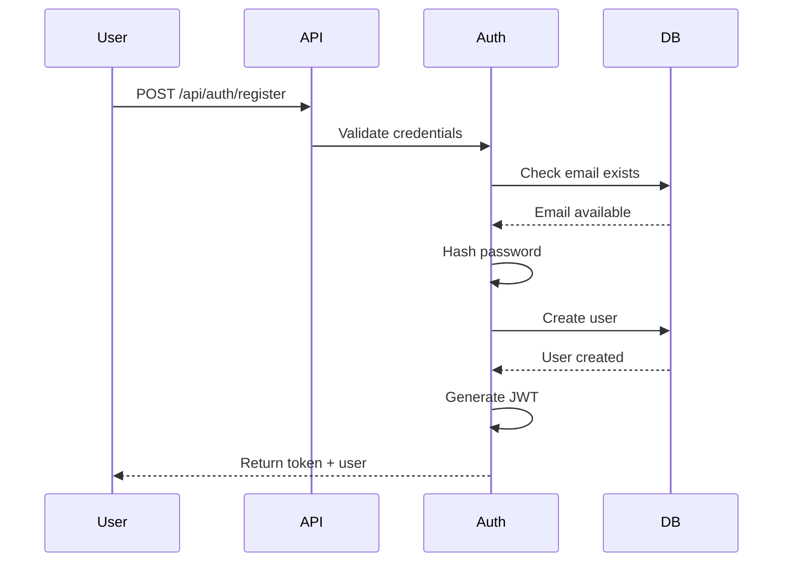
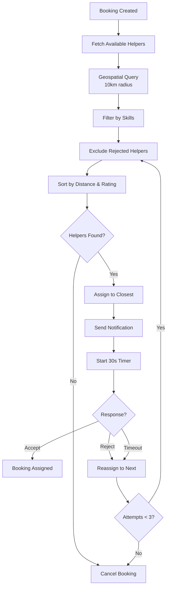
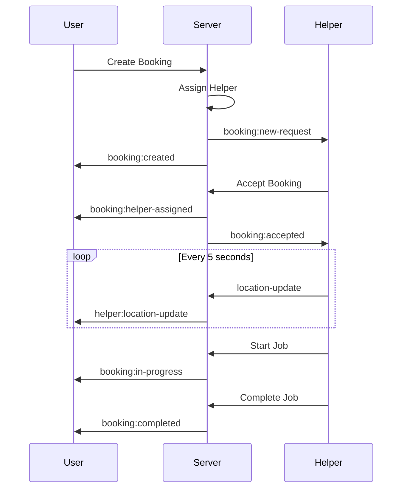
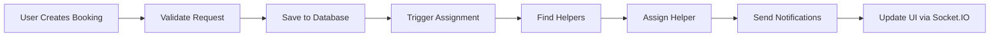
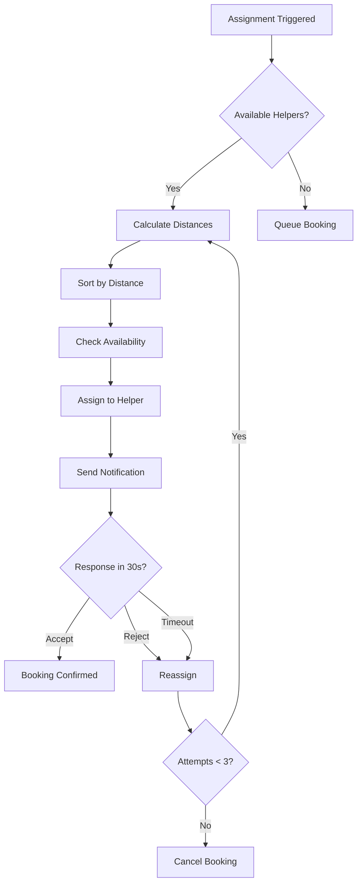
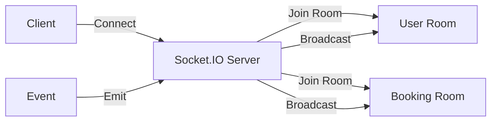
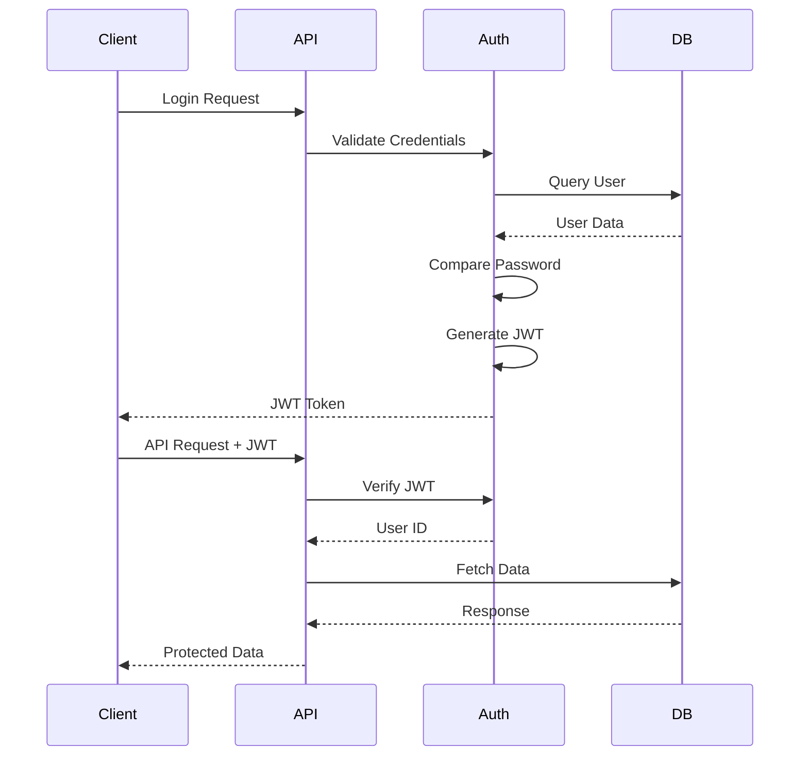
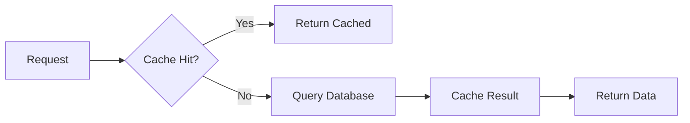
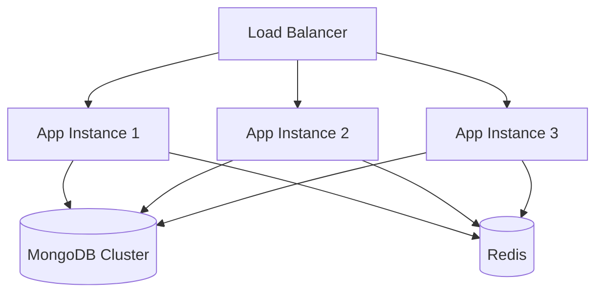

# System Architecture

Smart Helper Auto-Assignment System - Technical Architecture and Design

## Table of Contents

- [Overview](#overview)
- [System Architecture](#system-architecture)
- [Component Design](#component-design)
- [Data Flow](#data-flow)
- [Database Schema](#database-schema)
- [Assignment Algorithm](#assignment-algorithm)
- [Real-Time Communication](#real-time-communication)
- [Security Architecture](#security-architecture)

---

## Overview

The Smart Helper Auto-Assignment System is a location-based, on-demand service platform that connects users with nearby service professionals in real-time, promising service delivery within 15 minutes.

### Key Features

- **Smart Assignment**: AI-powered algorithm assigns nearest available helper
- **Real-Time Tracking**: Live location updates via WebSocket
- **Auto-Reassignment**: Automatic reassignment on rejection or timeout
- **Geofencing**: 10km radius-based matching
- **Multi-Channel Notifications**: SMS, Email, and In-App

---

## System Architecture



### Architecture Layers

1. **Client Layer**: Web browsers and mobile applications
2. **Load Balancer**: Nginx for SSL termination and load distribution
3. **Application Layer**: Node.js cluster with PM2 process management
4. **Real-Time Layer**: Socket.IO for WebSocket connections
5. **Data Layer**: MongoDB for persistence, Redis for caching
6. **External Services**: Third-party integrations

---

## Component Design

### 1. Authentication Module



**Components:**
- Password hashing (bcrypt)
- JWT token generation
- Session management
- Role-based access control

### 2. Assignment Algorithm



**Algorithm Steps:**
1. Fetch available helpers within 10km radius
2. Filter by required skills
3. Exclude previously rejected helpers
4. Sort by distance (primary) and rating (secondary)
5. Assign to closest helper
6. Wait for response (30 seconds)
7. Reassign if rejected or timeout
8. Cancel after 3 failed attempts

### 3. Real-Time Communication



---

## Data Flow

### Booking Creation Flow



### Helper Assignment Flow



---

## Database Schema

### Collections

**1. Users**
```javascript
{
  _id: ObjectId,
  name: String,
  email: String (unique),
  password: String (hashed),
  phone: String,
  role: String (enum: ['user', 'helper', 'admin']),
  location: {
    type: 'Point',
    coordinates: [longitude, latitude]
  },
  skills: [String], // For helpers
  rating: Number,
  availability: Boolean, // For helpers
  createdAt: Date
}
```

**Indexes:**
- `email` (unique)
- `location` (2dsphere)
- `role`

**2. Services**
```javascript
{
  _id: ObjectId,
  name: String,
  category: String,
  description: String,
  basePrice: Number,
  estimatedDuration: Number,
  icon: String
}
```

**3. Bookings**
```javascript
{
  _id: ObjectId,
  userId: ObjectId (ref: 'User'),
  serviceId: ObjectId (ref: 'Service'),
  helperId: ObjectId (ref: 'User'),
  status: String (enum: ['pending', 'assigned', 'in-progress', 'completed', 'cancelled']),
  location: {
    type: 'Point',
    coordinates: [longitude, latitude]
  },
  scheduledTime: Date,
  assignedAt: Date,
  completedAt: Date,
  rejectedHelpers: [ObjectId],
  rejectionCount: Number,
  notes: String,
  createdAt: Date
}
```

**Indexes:**
- `userId`
- `helperId`
- `status`
- `createdAt`

---

## Assignment Algorithm

### Distance Calculation (Haversine Formula)

```javascript
function calculateDistance(point1, point2) {
  const R = 6371; // Earth's radius in km
  const dLat = toRad(point2.latitude - point1.latitude);
  const dLon = toRad(point2.longitude - point1.longitude);
  
  const a = Math.sin(dLat/2) * Math.sin(dLat/2) +
            Math.cos(toRad(point1.latitude)) * 
            Math.cos(toRad(point2.latitude)) *
            Math.sin(dLon/2) * Math.sin(dLon/2);
  
  const c = 2 * Math.atan2(Math.sqrt(a), Math.sqrt(1-a));
  return R * c;
}
```

### Geospatial Query

```javascript
const helpers = await User.find({
  role: 'helper',
  availability: true,
  skills: serviceCategory,
  location: {
    $near: {
      $geometry: {
        type: 'Point',
        coordinates: [userLongitude, userLatitude]
      },
      $maxDistance: 10000 // 10km in meters
    }
  }
});
```

### Scoring Algorithm

```javascript
function scoreHelper(helper, userLocation) {
  const distance = calculateDistance(userLocation, helper.location);
  const distanceScore = 1 / (1 + distance); // Closer = higher score
  const ratingScore = helper.rating / 5; // Normalize to 0-1
  
  // Weighted score: 70% distance, 30% rating
  return (distanceScore * 0.7) + (ratingScore * 0.3);
}
```

---

## Real-Time Communication

### Socket.IO Architecture



### Event Types

**Client → Server:**
- `join` - Join user/helper room
- `location-update` - Update helper location
- `typing` - Chat typing indicator

**Server → Client:**
- `booking:created` - New booking created
- `booking:helper-assigned` - Helper assigned
- `booking:status-update` - Status changed
- `helper:location-update` - Helper location updated
- `notification` - General notification

---

## Security Architecture

### Authentication Flow



### Security Measures

1. **Password Security**
   - bcrypt hashing (10 rounds)
   - Minimum 6 characters
   - No plain text storage

2. **JWT Tokens**
   - HS256 algorithm
   - 24-hour expiration
   - Secure secret key

3. **API Security**
   - Rate limiting (100 req/15min)
   - CORS configuration
   - Input validation
   - SQL injection prevention

4. **Transport Security**
   - HTTPS/TLS 1.2+
   - Secure WebSocket (wss://)
   - Security headers (HSTS, CSP, etc.)

---

## Performance Optimization

### Caching Strategy



**Cached Data:**
- Service listings (1 hour TTL)
- Helper profiles (15 minutes TTL)
- User sessions (24 hours TTL)

### Database Optimization

- **Indexes**: Geospatial, email, status
- **Connection Pooling**: Max 10 connections
- **Query Optimization**: Projection, lean queries
- **Aggregation Pipeline**: For analytics

---

## Scalability

### Horizontal Scaling



**Scaling Strategy:**
- PM2 cluster mode (CPU cores)
- Docker container orchestration
- MongoDB replica sets
- Redis for session sharing

---

## Monitoring & Logging

### Metrics Tracked

- Request latency
- Error rates
- Database query performance
- Socket.IO connections
- Memory usage
- CPU utilization

### Logging Levels

- **ERROR**: Critical failures
- **WARN**: Potential issues
- **INFO**: General information
- **DEBUG**: Detailed debugging

---

## Technology Stack

| Layer | Technology |
|-------|-----------|
| Frontend | EJS, Bootstrap 5, Leaflet.js |
| Backend | Node.js, Express.js |
| Database | MongoDB 7.0 |
| Cache | Redis 7 |
| Real-Time | Socket.IO 4.8 |
| Authentication | JWT, bcrypt |
| Notifications | Twilio, Nodemailer |
| Deployment | Docker, PM2, Nginx |
| Testing | Jest, Supertest |

---

## Future Enhancements

1. **Machine Learning**
   - Demand prediction
   - Dynamic pricing
   - Helper performance analysis

2. **Advanced Features**
   - Multi-language support
   - Payment gateway integration
   - Advanced analytics dashboard
   - Mobile app (React Native)

3. **Infrastructure**
   - Kubernetes orchestration
   - Microservices architecture
   - GraphQL API
   - CDN integration
